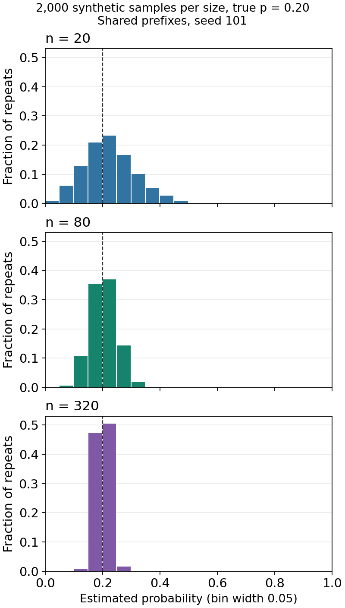

# Lesson 07 - Sampling uncertainty: more records need not mean more evidence

[Tiếng Việt](../../vi/lessons/2026-10-11-sampling-uncertainty/lesson.md) · [Download the C# lab](https://nguyenan97.github.io/computer-science-learning-agent/labs/sampling-uncertainty/dotnet-lab.zip)

A .NET service observes two failed requests out of twenty. Reporting 10% is a correct count, but another twenty requests can give a different rate. If each original request is logged ten times by retries, 200 rows do not provide 200 independent observations. We will quantify both effects before deciding what the dashboard may claim.

**Goal:** derive a proportion interval, check its implementation independently, examine its repeated-sampling coverage and find a counterexample to the independence assumption. The planner chooses probability, estimation and uncertainty after the current catalog. We reuse invariants, independent checks and bounded claims; random variables, expectation, variance, sampling distributions and confidence intervals are introduced here.

## Core ideas

- **A sample and its target.** Twenty selected requests are evidence about a specified stream, not every possible deployment. Define which requests and time window the estimate concerns before calculating it.
- **A binary outcome and uncertainty.** Encode a failure as 1 and a nonfailure as 0. Two ones in twenty give an estimate of 0.10; a new sample need not have the same count.
- **Independence.** Twenty fresh decisions differ from twenty copies of one decision. Shared requests or outages can link outcomes, making the nominal row count overstate the information.
- **A confidence procedure.** An interval changes when the sample changes. Its coverage is the fraction of repeated samples whose intervals contain a fixed true probability under the model, not a probability assigned to that fixed parameter after seeing one interval.
- **Reproducible simulation.** A seed reproduces synthetic observations. It lets us debug an experiment, but it cannot make its model representative of production.

Use the worked traces, full code and observed chart as a reading-only route. Timebox setup to 15 minutes of the lab block. The simulations use synthetic data and create a CSV in their working directory.

## 1. Recall and the new question

**Recall · 20 minutes.** Reconstruct the planner-selected boundaries, then distinguish correctness from statistical evidence. **Done when:** you can name what each earlier check established and what a new sample changes.

1. From Lesson 06: why do atomic write transactions not repair the blind lost-update workflow?

<details>
<summary>Answer</summary>

The reads happened earlier outside each write transaction. Serializing the later writes does not refresh their application values. Validate expected version/current stock and commit the decrement plus receipt together; A+S=I is the one-item invariant.

</details>

2. From Lesson 04: why must one-row 0/1 DP update capacities downwards? Give a counterexample.

<details>
<summary>Answer</summary>

The lower lookup must retain the previous prefix. One job with cost 2, value 3 and capacity 4: ascending writes 3 at capacity 2, then reuses it to write 6 at 4, although the 0/1 optimum is 3. Descending preserves the old layer at c-cost.

</details>


The database oracle checked a chosen schedule; the DP proof checked the meaning of a state. Neither makes the measured frequency of failures in one traffic sample a universal rate. Today the count can be correct while the estimate is uncertain. Transaction retries also help expose our new question: what is the independent observational unit?

## 2. From a count to a sampling model

**Foundation · 50 minutes.** Trace five observations and derive the spread of a sample proportion. **Done when:** you can state the target, independent unit and invariant before using the formulas.

### Start with observed outcomes

Let five synthetic request outcomes be 1,0,1,0,0. Keep n as the number observed and k as the number of ones. Before each append, k equals the sum of the prefix and 0<=k<=n. Appending x updates k to k+x and n to n+1, preserving that invariant.

Complete the trace, including the changing proportion and interval. Does the final 0.40 prove that every later block has 40% failures?

<details>
<summary>Answer</summary>

| n | New outcome | k | h=k/n | Wilson interval, rounded |
|---|---|---|---|---|
| 1 | 1 | 1 | 1.0000 | [0.2065,1.0000] |
| 2 | 0 | 1 | 0.5000 | [0.0945,0.9055] |
| 3 | 1 | 2 | 0.6667 | [0.2077,0.9385] |
| 4 | 0 | 2 | 0.5000 | [0.1500,0.8500] |
| 5 | 0 | 2 | 0.4000 | [0.1176,0.7693] |

The count invariant holds after every append. The intervals are Wilson calculations explained below, not proof that the five observations identify p. A new block can differ even under fixed p; this trace alone establishes no future frequency.

</details>


### Explain the probability model

A random variable assigns a number to an uncertain outcome. A Bernoulli variable X has only 0 and 1, with P(X=1)=p and P(X=0)=1-p. Here 1 means a failure; the traditional statistical word "success" means the counted event, not a healthy request. In production p is unknown. Our simulator sets p explicitly so coverage can be checked.

IID means independent and identically distributed: outcomes have the same p, and knowing earlier outcomes does not change the probabilities of later ones in the model. Equal marginal rates alone do not imply independence. The all-copies example has the same p for every row but perfect dependence within a group. Real finite samples without replacement or time-varying incidents need an appropriate model; we use IID draws as a deliberate starting assumption.

Expectation is a probability-weighted average over possible samples. Variance is the expected squared distance from that average; standard deviation is its square root. Since X^2=X, E[X]=p and Var(X)=p(1-p). These are model quantities, not observed averages from one run.

For K=X1+...+Xn and the estimate h=K/n, linearity gives E[h]=p. Covariance measures whether two outcomes deviate together: Cov(Xi,Xj)=E[(Xi-p)(Xj-p)]. Independent outcomes have covariance zero, while copies of the same outcome have covariance p(1-p). In the variance of a sum, independence therefore eliminates the cross terms, giving:

```text
Var(h) = p(1-p)/n
SD(h)  = sqrt(p(1-p)/n)
```

The sample proportion is a random quantity before data are collected; after collection its value is fixed. At p=0.20, the model SD is about 0.0894 for n=20, 0.0447 for n=80 and 0.0224 for n=320. These are spreads across fresh samples, not SDs of a single binary record or timings.

Why does multiplying n by four halve this model SD, and where would the argument fail for copied rows?

<details>
<summary>Answer</summary>

sqrt(p(1-p)/(4n)) is half sqrt(p(1-p)/n). This requires the same p and independent contributions. For linked rows, covariance terms remain; copying each outcome four times leaves the mean unchanged and does not halve its true spread.

</details>


### An interval obtained by checking candidate probabilities

For k=2,n=20, h=0.10. The Wilson interval below is about [0.0279,0.3010], showing why the point estimate alone is incomplete. It comes from retaining candidate probabilities p whose standardized discrepancy is not too large. The normal distribution is a bell-shaped probability curve; the standard normal has mean zero and standard deviation one. Use z=1.959963984540054, the cutoff that encloses the central 95% of a standard normal distribution; z is a supplied constant here, not an inferred rate.

The accepted candidates satisfy `n(h-p)^2 <= z^2 p(1-p)`. This score condition uses the candidate's variance. Rearranging gives `(n+z^2)p^2-(2nh+z^2)p+nh^2 <= 0`. Its leading coefficient is positive, so the accepted set lies between its roots. Dividing the quadratic formula by n yields:

```text
d = 1 + z^2/n
center = (h + z^2/(2n))/d
radius = z*sqrt(h(1-h)/n + z^2/(4n^2))/d
interval = [center-radius, center+radius]
```

Restrict candidates to [0,1]; the k=0 and k=n limits are exactly 0 and 1 on the corresponding side. h itself satisfies the condition. The quadratic proves what interval this calculation returns. It does not prove finite-sample coverage is exactly 95%: interpreting the cutoff relies on a normal approximation to the binomial score, and discrete counts affect coverage.

What does "95% confidence" mean here, and what does it not establish for the one observed interval?

<details>
<summary>Answer</summary>

Before sampling, the bounds are random and p is fixed. A nominal 95% procedure aims at about 95% coverage across repeated model samples; Wilson's finite coverage can differ. After observing the bounds, membership of the fixed p is fixed, so this frequentist calculation does not assign it posterior probability 0.95. It also says nothing about the fraction of requests inside the interval or sampling bias.

</details>


Pause - 10 minutes away from the screen.

## 3. Read the assumptions and challenge a familiar interval

**Source reading · 45 minutes.** Build a claim/evidence/limit ledger from the specified sections. **Done when:** you distinguish a derived formula, an approximation and a model violation.

Read OpenStax [8.3, A Population Proportion](https://openstax.org/books/introductory-statistics-2e/pages/8-3-a-population-proportion), from the binomial model through the normal approximation and proportion error bound; and [7.1, Central Limit Theorem](https://openstax.org/books/introductory-statistics-2e/pages/7-1-the-central-limit-theorem-for-sample-means-averages), the opening account of repeated sample means and their spread. The textbook introduces the usual normal/Wald interval, not our Wilson implementation. We derive Wilson above and inspect its implementation next. A central-limit approximation concerns increasing independent sample size; "n>=30" alone cannot repair dependence or rare-event boundaries.

### A zero-count counterexample

The Wald interval replaces p in the variance by h and returns `h +/- z*sqrt(h(1-h)/n)`; our lab clips it to [0,1]. Calculate both methods for zero failures in twenty requests and explain the defect.

<details>
<summary>Answer</summary>

Wald gives [0,0], falsely eliminating uncertainty from the calculation. Wilson gives [0,0.1611] because at k=0 its upper endpoint is z^2/(n+z^2). A positive true p can produce zero observed events: at p=0.02, P(K=0)=0.98^20, about 0.668. Neither interval proves the production rate is zero; Wilson is still an approximate procedure.

</details>


Clipping endpoints avoids probabilities outside [0,1], but it cannot restore the lost uncertainty at h=0. Nor can a larger sample correct a selection rule that systematically excludes failures. For example, reading only 500 healthy rows while ignoring 50 failures gives h=0; the complete 550-row cohort has rate 50/550. An interval for the selected healthy subset answers the wrong population question.

Read the [SciPy 1.16.2 proportion_ci API](https://docs.scipy.org/doc/scipy-1.16.2/reference/generated/scipy.stats._result_classes.BinomTestResult.proportion_ci.html), its parameters/methods/returns, and the [R binom.test Details](https://stat.ethz.ch/R-manual/R-devel/library/stats/html/binom.test.html). R documents at-least-nominal coverage for Clopper-Pearson under the binomial model, with a length trade-off. That guarantee does not transfer to Wilson, to dependent observations or to a biased sample. We do not implement exact interval endpoints today; "binomial_sum" later evaluates coverage of our selected methods.

Write a three-row ledger for smaller spread with n, Wilson's nominal 95%, and interpreting retry rows as observations.

<details>
<summary>Answer</summary>

| Claim | Evidence | Limit |
|---|---|---|
| IID proportion spread decreases as 1/sqrt(n) | Bernoulli variance derivation; OpenStax sampling distribution | Covariance/drift changes the model |
| Wilson uses a nominal 95% cutoff | Score derivation; SciPy quantile branch | Discrete finite coverage need not be 0.95 |
| Retry rows may overcount evidence | Same-request grouping; controlled copied-group example | Real group sizes/outcomes may differ; dedupe alone does not prove independence |

</details>


## 4. A project dashboard and SciPy's interval API

**Implementation reading · 45 minutes.** Follow the method selection and boundary handling at one immutable commit. **Done when:** you can map each source branch to an API decision without claiming unrun integration behavior.

### Apply it to a .NET operational report

An ASP.NET service can report the rate of original requests that fail during a defined interval. Store or query one agreed outcome per request ID, include the count and sampling policy, and show uncertainty alongside the point estimate. SQL Server can aggregate the chosen cohort, but COUNT/SUM cannot establish independence or representativeness. Azure instances share incidents; retries, dropped telemetry and tenant mixture can change the target. No SQL Server/dashboard integration is executed in this lesson.

If the report describes the complete fixed cohort, k/n is its exact descriptive fraction. An interval becomes useful when making a model-based inference to an underlying process or another period. Specify that target explicitly. Dedupe removes repeated rows; it does not remove a common outage or make future traffic stationary.

### A scientific tool makes methods and limits explicit

SciPy gives users a result object with a point estimate and a selectable interval method for binary event counts, such as adverse-event or failed-request counts. Its workload is the summary (k,n), not storing every raw observation. Without an interval, the same point estimate can conceal very different amounts of evidence. Read tag v1.16.2 at commit **b1296b9b4393e251511fe8fdd3e58c22a1124899**, only `scipy/stats/_binomtest.py`:

- [BinomTestResult and proportion_ci, lines 10-114](https://github.com/scipy/scipy/blob/b1296b9b4393e251511fe8fdd3e58c22a1124899/scipy/stats/_binomtest.py#L10-L114): retains k/n and the alternative, validates the method/confidence level, defaults to exact and dispatches Wilson options separately.
- [Exact interval helper, lines 117-159](https://github.com/scipy/scipy/blob/b1296b9b4393e251511fe8fdd3e58c22a1124899/scipy/stats/_binomtest.py#L117-L159): uses a numerical root solver on binomial tails, with explicit k=0/k=n branches. We inspect dispatch and boundary meaning, not the solver's entire implementation.
- [Wilson helper, lines 162-199](https://github.com/scipy/scipy/blob/b1296b9b4393e251511fe8fdd3e58c22a1124899/scipy/stats/_binomtest.py#L162-L199): obtains a normal quantile, uses the Wilson center/radius when correction is false, and handles one-sided and boundary cases.

**Verified from source:** the product offers exact, wilson and wilsoncc; exact is the default; two-sided Wilson uses the normal quantile at 0.5+0.5*confidence_level; zero and all-event boundaries are explicit. **Design inference:** making the method visible in our .NET report prevents callers from silently treating every interval as having the same guarantee. Our lab implements only two-sided, uncorrected Wilson with fixed z, not SciPy's complete API, tests, p-values or exact endpoints. SciPy is read but not installed/executed in the lab.

Trace the source choice for k=7,n=50, two-sided 95%, method='wilson', and contrast the default method.

<details>
<summary>Answer</summary>

The method selects Wilson with correction=false. For two-sided 95%, z is the normal 0.975 quantile. h=0.14 gives the center/radius branch, producing approximately [0.0695,0.2619] in our C# calculation. A call with no method selects exact, which solves binomial tails; the official API example reports about [0.05819,0.26740] for these counts. We read that example, not execute SciPy. Matching this algebra is not full cross-runtime parity or implementation of one-sided/corrected cases.

</details>


What trade-off would you explain before choosing this Wilson calculation for a dashboard?

<details>
<summary>Answer</summary>

Wilson avoids Wald's zero-width boundary and is cheap to compute from k/n, but its finite coverage can fall below the nominal level. Exact binomial intervals make a different coverage/length trade-off under the model. Neither handles bias or arbitrary dependence automatically. Exposing method, unit, cohort and count is our design recommendation, not a documented claim about every SciPy user's motivation.

</details>


Lunch and rest - 30 minutes.

## 5. C# lab: estimate, check and repair

**Lab · 75 minutes.** Implement the interval, verify endpoints and run the synthetic experiment. **Done when:** formula/oracle results agree and you can explain the defect without mistaking correctness tests for coverage.

Implement the count invariant and Wilson formula. Check every possible k for small n against numerical inversion of the score condition; then run the repeated-sampling and dependence cases. Use the complete answer if setup exceeds its timebox.

<details>
<summary>Answer - complete runnable lab</summary>

Use SDK **10.0.401**, runtime **Microsoft.NETCore.App 10.0.12**, target **net10.0**; SDK/runtime roll-forward is disabled. There are no external NuGet packages; the empty lock file is still checked. This runtime ships with the pinned SDK. The SDK/reference pack must be available for the initial restore; no database server is needed.

Extract the ZIP or create `dotnet` with all files below. Run from `dotnet`. Only experiment mode writes `distribution.csv` in the current directory; the program does not access a database or the network.

`global.json`:

```json
{
  "sdk": { "version": "10.0.401", "rollForward": "disable" }
}
```

`LessonLab/LessonLab.csproj`:

```xml
<Project Sdk="Microsoft.NET.Sdk">
  <PropertyGroup>
    <OutputType>Exe</OutputType>
    <TargetFramework>net10.0</TargetFramework>
    <RuntimeFrameworkVersion>10.0.12</RuntimeFrameworkVersion>
    <RollForward>Disable</RollForward>
    <ImplicitUsings>enable</ImplicitUsings>
    <Nullable>enable</Nullable>
    <TreatWarningsAsErrors>true</TreatWarningsAsErrors>
    <RestorePackagesWithLockFile>true</RestorePackagesWithLockFile>
    <RestoreLockedMode>true</RestoreLockedMode>
  </PropertyGroup>
</Project>
```

`LessonLab/packages.lock.json`:

```json
{
  "version": 1,
  "dependencies": {
    "net10.0": {}
  }
}
```

Run commands:

```bash
cd dotnet
dotnet --version
dotnet restore LessonLab --locked-mode
dotnet run --no-restore -c Release --project LessonLab
dotnet run --no-restore -c Release --project LessonLab -- --check
dotnet run --no-restore -c Release --project LessonLab -- --experiment
```

`LessonLab/Stats.cs`. Wilson is derived from the score inequality. Wald is retained as a counterexample. Binomial sums use BigInteger numerators, not simulation; endpoint decisions and ratio conversion still use double.

```csharp
// Original MIT teaching code, derived from the score inequality, not copied from SciPy.
using System.Numerics;

public readonly record struct Interval(double Low, double High)
{
    public double Width => High - Low;
    public bool Contains(double p) => Low <= p && p <= High;
}

public static class Stats
{
    public const double Z = 1.959963984540054; // Central 95% of a standard normal distribution.
    private static void Validate(int k, int n)
    {
        if (n < 1 || n > 10000 || k < 0 || k > n) throw new ArgumentOutOfRangeException(nameof(n));
    }
    public static Interval Wilson(int k, int n)
    {
        Validate(k, n);
        double h = (double)k / n, z2 = Z * Z, denominator = 1 + z2 / n;
        double center = (h + z2 / (2 * n)) / denominator;
        double radius = Z * Math.Sqrt(h * (1 - h) / n + z2 / (4 * n * n)) / denominator;
        return new Interval(k == 0 ? 0 : center - radius, k == n ? 1 : center + radius);
    }
    public static Interval Wald(int k, int n)
    {
        Validate(k, n);
        double h = (double)k / n, radius = Z * Math.Sqrt(h * (1 - h) / n);
        return new Interval(Math.Max(0, h - radius), Math.Min(1, h + radius));
    }
    public static BigInteger[] BinomialWeights(int n, int a, int b)
    {
        if (n < 1 || n > 320 || a < 0 || a > b || b < 1 || b > 50)
            throw new ArgumentOutOfRangeException(nameof(n));
        var weights = new BigInteger[n + 1]; BigInteger choose = 1;
        for (int k = 0; k <= n; k++)
        {
            weights[k] = choose * BigInteger.Pow(a, k) * BigInteger.Pow(b - a, n - k);
            if (k < n) choose = choose * (n - k) / (k + 1);
        }
        return weights; // Exact numerator; common denominator is b^n.
    }
    public static double Coverage(int n, int a, int b, Func<int, int, Interval> method, int copies = 1)
    {
        if (copies < 1 || (long)n * copies > 10000) throw new ArgumentOutOfRangeException(nameof(copies));
        var weights = BinomialWeights(n, a, b); BigInteger covered = 0;
        double p = (double)a / b;
        for (int k = 0; k <= n; k++)
            if (method(k * copies, n * copies).Contains(p)) covered += weights[k];
        // Exact integer sums; membership uses double. Scale the ratio before conversion,
        // so large denominators never overflow to infinity. Truncation is below 2^-53.
        BigInteger scale = BigInteger.One << 53;
        return (double)(covered * scale / BigInteger.Pow(b, n)) / (double)scale;
    }
}
```

`LessonLab/Draws.cs`. The generator has explicit state and seed. Rejection before taking a remainder avoids modulo bias if outputs are treated as uniform; it does not prove calls are independent. This is neither a security generator nor an RNG quality benchmark.

```csharp
// Small deterministic generator for reproducible teaching, not for security.
public sealed class Draws
{
    private const long Modulus = 2147483647;
    private long state;
    public Draws(int seed)
    {
        if (seed < 1 || seed >= Modulus) throw new ArgumentOutOfRangeException(nameof(seed));
        state = seed;
    }
    public int NextRaw() { state = 48271 * state % Modulus; return (int)state; }
    public int Below(int bound)
    {
        if (bound < 1 || bound > 10000) throw new ArgumentOutOfRangeException(nameof(bound));
        long limit = (Modulus - 1) - (Modulus - 1) % bound;
        long value;
        do { value = NextRaw() - 1L; } while (value >= limit);
        return (int)(value % bound);
    }
    public int Bernoulli(int a, int b)
    {
        if (b < 1 || b > 10000 || a < 0 || a > b) throw new ArgumentOutOfRangeException(nameof(a));
        return Below(b) < a ? 1 : 0;
    }
}
```

`LessonLab/Checks.cs`. The oracle finds two roots by binary search on the score condition, without the closed Wilson formula. Exhaustive small bit sequences independently check the binomial weights.

```csharp
using System.Numerics;

public static class Checks
{
    private static void Require(bool test, string why) { if (!test) throw new Exception(why); }
    private static void Throws(Action action)
    {
        try { action(); } catch (ArgumentOutOfRangeException) { return; }
        throw new Exception("Expected argument rejection.");
    }
    // Numerical inversion of the acceptance condition, without Wilson's closed formula.
    private static Interval ScoreRoots(int k, int n)
    {
        double h = (double)k / n;
        bool Accepted(double p) => n * (h - p) * (h - p) <= Stats.Z * Stats.Z * p * (1 - p);
        double low = 0, high = 1;
        if (k != 0)
        {
            double left = 0, right = h;
            for (int i = 0; i < 80; i++) { double mid = (left + right) / 2; if (Accepted(mid)) right = mid; else left = mid; }
            low = (left + right) / 2;
        }
        if (k != n)
        {
            double left = h, right = 1;
            for (int i = 0; i < 80; i++) { double mid = (left + right) / 2; if (Accepted(mid)) left = mid; else right = mid; }
            high = (left + right) / 2;
        }
        return new Interval(low, high);
    }
    public static void Run()
    {
        int cases = 0;
        for (int n = 1; n <= 200; n++)
            for (int k = 0; k <= n; k++)
            {
                var actual = Stats.Wilson(k, n); var oracle = ScoreRoots(k, n);
                Require(Math.Abs(actual.Low - oracle.Low) < 2e-12 && Math.Abs(actual.High - oracle.High) < 2e-12, "Score inversion differs.");
                Require(actual.Low >= 0 && actual.High <= 1 && actual.Contains((double)k / n), "Invalid interval.");
                var complement = Stats.Wilson(n - k, n);
                Require(Math.Abs(actual.Low - (1 - complement.High)) < 2e-12, "Complement differs."); cases++;
            }
        var zero = Stats.Wilson(0, 20);
        Require(zero.Low == 0 && Math.Abs(zero.High - 0.1611251580528194) < 1e-12, "Zero-case fixture differs.");
        Require(Stats.Wald(0, 20).Width == 0, "Wald counterexample missing.");
        // Exhaustive binary sequences give a second, independent count of the binomial weights.
        for (int n = 1; n <= 10; n++)
        {
            var counts = new int[n + 1];
            for (uint bits = 0; bits < (1u << n); bits++) counts[BitOperations.PopCount(bits)]++;
            var weights = Stats.BinomialWeights(n, 1, 2);
            for (int k = 0; k <= n; k++) Require(weights[k] == counts[k], "Sequence oracle differs.");
        }
        foreach (int n in new[] { 20, 80, 320 })
        {
            var weights = Stats.BinomialWeights(n, 1, 5);
            Require(weights.Aggregate(BigInteger.Zero, (s, w) => s + w) == BigInteger.Pow(5, n), "Probability mass differs.");
        }
        Require(Stats.BinomialWeights(3, 1, 5).SequenceEqual(new BigInteger[] { 64, 48, 12, 1 }), "Three-draw fixture differs.");
        Require(double.IsFinite(Stats.Coverage(320, 1, 50, Stats.Wilson)), "Large denominator overflowed.");
        Require(Stats.Coverage(20, 0, 5, Stats.Wilson) == 1 && Stats.Coverage(20, 5, 5, Stats.Wilson) == 1, "Degenerate probability differs.");
        var rng = new Draws(1);
        foreach (int value in new[] { 48271, 182605794, 1291394886, 1914720637, 2078669041 })
            Require(rng.NextRaw() == value, "Generator sequence differs.");
        var same = new Draws(101); var again = new Draws(101);
        for (int i = 0; i < 100; i++) Require(same.Bernoulli(1, 5) == again.Bernoulli(1, 5), "Seed not reproducible.");
        Throws(() => Stats.Wilson(0, 0)); Throws(() => Stats.Wilson(21, 20)); Throws(() => Stats.Wilson(-1, 20));
        Throws(() => Stats.Wilson(0, 10001)); Throws(() => new Draws(0)); Throws(() => rng.Below(0));
        Throws(() => rng.Bernoulli(2, 1)); Throws(() => Stats.Coverage(20, 1, 5, Stats.Wilson, 0));
        Console.WriteLine($"PASS: {cases} score inversions; binary-sequence weights; endpoints; seed; validation.");
    }
}
```

`LessonLab/Experiment.cs`. Each repetition generates 320 observations and takes prefixes of 20/80/320 from that same sequence. Wilson/Wald receive identical counts. Rare-event and cluster cases have separate seeds and test different assumptions.

```csharp
using System.Globalization;

public static class Experiment
{
    private const int Repetitions = 2000;
    private sealed record Result(string Case, int Units, int Records, int A, int B, string Method,
        int[] Counts, Func<int, int, Interval> Interval, int Copies = 1);
    public static void Run()
    {
        var results = new List<Result>(); var rng = new Draws(101);
        var prefix = new Dictionary<int, int[]> { [20] = new int[Repetitions], [80] = new int[Repetitions], [320] = new int[Repetitions] };
        for (int r = 0; r < Repetitions; r++)
        {
            int successes = 0;
            for (int i = 1; i <= 320; i++) { successes += rng.Bernoulli(1, 5); if (prefix.ContainsKey(i)) prefix[i][r] = successes; }
        }
        foreach (var (n, counts) in prefix)
            foreach (string method in new[] { "Wilson", "Wald" })
                results.Add(new Result("prefix", n, n, 1, 5, method, counts, method == "Wilson" ? Stats.Wilson : Stats.Wald));
        rng = new Draws(202); var rare = new int[Repetitions];
        for (int r = 0; r < Repetitions; r++) for (int i = 0; i < 20; i++) rare[r] += rng.Bernoulli(1, 50);
        results.Add(new Result("rare", 20, 20, 1, 50, "Wilson", rare, Stats.Wilson));
        results.Add(new Result("rare", 20, 20, 1, 50, "Wald", rare, Stats.Wald));
        rng = new Draws(303); var iid = new int[Repetitions]; var groups = new int[Repetitions];
        for (int r = 0; r < Repetitions; r++)
            for (int i = 0; i < 200; i++) { int x = rng.Bernoulli(1, 5); iid[r] += x; if (i < 20) groups[r] += x; }
        results.Add(new Result("iid", 200, 200, 1, 5, "Wilson", iid, Stats.Wilson));
        results.Add(new Result("cluster-naive", 20, 200, 1, 5, "Wilson", groups.Select(k => 10 * k).ToArray(), Stats.Wilson, 10));
        results.Add(new Result("cluster-unit", 20, 200, 1, 5, "Wilson", groups, Stats.Wilson));
        Console.WriteLine("case,units,records,p,method,covered,repetitions,empirical,binomial_sum,mean_width");
        foreach (var row in results)
        {
            int covered = 0; double width = 0, p = (double)row.A / row.B;
            foreach (int k in row.Counts) { var ci = row.Interval(k, row.Units * row.Copies); if (ci.Contains(p)) covered++; width += ci.Width; }
            double exact = Stats.Coverage(row.Units, row.A, row.B, row.Interval, row.Copies);
            Console.WriteLine(FormattableString.Invariant($"{row.Case},{row.Units},{row.Records},{p:F2},{row.Method},{covered},{Repetitions},{(double)covered / Repetitions:F4},{exact:F6},{width / Repetitions:F6}"));
        }
        using var csv = new StreamWriter("distribution.csv", false);
        csv.WriteLine("n,bin_left,bin_right,count,repetitions");
        foreach (var (n, counts) in prefix)
        {
            var bins = new int[20]; foreach (int k in counts) bins[Math.Min(19, k * 20 / n)]++;
            for (int b = 0; b < bins.Length; b++) csv.WriteLine(FormattableString.Invariant($"{n},{b / 20.0:F2},{(b + 1) / 20.0:F2},{bins[b]},{Repetitions}"));
        }
        Console.WriteLine("# wrote distribution.csv; seeds=101/202/303; no elapsed-time benchmark");
    }
}
```

`LessonLab/Program.cs`. The demo updates the count after each observation. Arguments select checks or the experiment.

```csharp
using System.Globalization;
CultureInfo.CurrentCulture = CultureInfo.InvariantCulture;
if (args.Length == 1 && args[0] == "--check") { Checks.Run(); return; }
if (args.Length == 1 && args[0] == "--experiment") { Experiment.Run(); return; }
if (args.Length != 0) throw new ArgumentException("Use no argument, --check or --experiment.");
Console.WriteLine("n,k,estimate,wilson_low,wilson_high");
int count = 0, n = 0;
foreach (int observation in new[] { 1, 0, 1, 0, 0 })
{
    count += observation; n++; var ci = Stats.Wilson(count, n);
    Console.WriteLine($"{n},{count},{(double)count / n:F4},{ci.Low:F4},{ci.High:F4}");
}
```

Expected demo, checked against an execution:

```text
n,k,estimate,wilson_low,wilson_high
1,1,1.0000,0.2065,1.0000
2,1,0.5000,0.0945,0.9055
3,2,0.6667,0.2077,0.9385
4,2,0.5000,0.1500,0.8500
5,2,0.4000,0.1176,0.7693
```

Expected `--check` output:

```text
PASS: 20300 score inversions; binary-sequence weights; endpoints; seed; validation.
```

Checks cover 20,300 pairs (k,n) with n=1-200, endpoints, symmetry, invalid arguments, total probability and repeatable seeds. Bit enumeration covers n=1-10 at p=1/2; a three-draw p=1/5 fixture and probability-mass checks supplement larger cases. This does not prove 95% coverage, RNG quality or representative real data. The score oracle is computationally independent but uses the same chosen mathematical condition.

</details>


Defect exercise: change `double h = (double)k / n` to integer division `double h = k / n` in Wilson. Predict a failing case and repair it.

<details>
<summary>Answer</summary>

At k=1,n=2, integer division returns h=0 instead of 0.5. Wilson then gives the zero-count interval rather than [0.0945,0.9055]; the root oracle also detects the discrepancy. Convert before dividing. Assigning an already-truncated quotient to double does not recover the fraction. Keep the bisection oracle's division floating-point so the two implementations do not share that bug.

</details>


Pause - 10 minutes away from the screen.

## 6. Controlled simulation, coverage and a visible distribution

**Experiment · 45 minutes.** Predict the comparisons, inspect the CSV/chart and explain departures from the model. **Done when:** you distinguish nominal confidence, finite-model coverage and one seeded observation.

### Keep each comparison controlled

Hold p=1/5, 2,000 repetitions, generator and seed 101 fixed. Generate 320 outcomes per repetition, then use prefixes of 20,80,320. Wilson/Wald see identical k within each prefix. Increasing prefix length changes sample size; methods are a separate comparison. The rare-event case changes p to 1/50 at n=20 and seed 202. The dependence case uses seed 303: 200 IID outcomes versus twenty latent outcomes copied ten times each, with the latent outcomes taken from the same 200-draw repetition. These are deliberately separate experiments, not one comparison that changes everything.

Predict the direction of spread, interval width and coverage for larger n, rare events and copied groups.

<details>
<summary>Answer</summary>

Larger independent prefixes should narrow typical intervals and concentrate estimates, roughly at the 1/sqrt(n) scale; no monotone coverage theorem follows. Wald should fail especially badly at rare-event zero counts. Copying groups should make row-based intervals too narrow; group-based counts should recover the toy model's effective n. Width and coverage must be compared separately. A narrower interval is not automatically better.

</details>


### Calculate coverage without random sampling

For n=3,p=1/5, the number K of events can be 0,1,2,3. Counts of sequences are 1,3,3,1; their exact probabilities are 64/125,48/125,12/125,1/125. For example, three positions for one event give `3*(1/5)*(4/5)^2`. In general there are C(n,k) binary sequences with k events, yielding:

```text
P(K=k) = C(n,k) p^k (1-p)^(n-k)
coverage(n,p) = sum over k with p in interval(k,n) of P(K=k)
```

Here C(n,k) counts the ways to choose the k event positions. The C# recurrence for these integer counts follows `C(n,k+1)=C(n,k)*(n-k)/(k+1)`. One way to justify the recurrence is counting a k-position choice plus one new event position in two ways: C(n,k)*(n-k)=C(n,k+1)*(k+1). This is enumeration of a model, not evidence that real request outcomes follow it.

Explain how this sum distinguishes a Monte Carlo fluctuation from a systematic interval problem.

<details>
<summary>Answer</summary>

The finite sum has no random draw error: it weights each possible k by the specified binomial model. Simulation fluctuates around that model's coverage if its draws approximate the model. At rare p=0.02,n=20, Wilson's sum is about 0.940101, so observing coverage near 0.94 is not merely a defect in the simulator. Numerical endpoints/rounding remain, and correct enumeration says nothing about whether production is binomial.

</details>


### Observed synthetic output

Run `--experiment` and compare its CSV and distribution with the recorded synthetic run.

<details>
<summary>Answer - observed output and distribution</summary>

The following output was produced by the pinned C# runtime, not invented expected timings. `covered` counts intervals containing the simulator's known p. `empirical` divides by 2,000. `binomial_sum` sums the finite model's weights using the interval's double endpoints; it is not the Clopper-Pearson method. `mean_width` averages interval width, not an error guarantee.


```text
case,units,records,p,method,covered,repetitions,empirical,binomial_sum,mean_width
prefix,20,20,0.20,Wilson,1905,2000,0.9525,0.956328,0.326045
prefix,20,20,0.20,Wald,1836,2000,0.9180,0.920843,0.327257
prefix,80,80,0.20,Wilson,1932,2000,0.9660,0.965245,0.171524
prefix,80,80,0.20,Wald,1854,2000,0.9270,0.932055,0.173177
prefix,320,320,0.20,Wilson,1927,2000,0.9635,0.957630,0.087252
prefix,320,320,0.20,Wald,1901,2000,0.9505,0.945410,0.087479
rare,20,20,0.02,Wilson,1863,2000,0.9315,0.940101,0.187112
rare,20,20,0.02,Wald,678,2000,0.3390,0.331792,0.056121
iid,200,200,0.20,Wilson,1919,2000,0.9595,0.958498,0.109939
cluster-naive,20,200,0.20,Wilson,1164,2000,0.5820,0.598123,0.105257
cluster-unit,20,200,0.20,Wilson,1906,2000,0.9530,0.956328,0.324538
# wrote distribution.csv; seeds=101/202/303; no elapsed-time benchmark
```




[Open the chart at full resolution](sampling-distribution.png).

The chart is generated from the lab's [observed synthetic histogram CSV](../../labs/sampling-uncertainty/distribution.csv). Each bar is the fraction of 2,000 repetitions in a width-0.05 estimate bin; all panels share axes. The horizontal axis covers the full probability range 0-1, so rare distant bins remain visible. Discrete n=20 estimates lie on a 0.05 grid; bins can hide fine detail. Larger n concentrates estimates around 0.20, not necessarily every single sample closer to p.

To draw it yourself without another code dependency, run `--experiment`, import distribution.csv into a spreadsheet, filter each n and plot count/repetitions against bin_left using a fixed 0-1 horizontal scale and shared vertical scale. The last bin includes 1. The page's static plot is the reading-only route, not a requirement to install Python.

</details>

### Break independence explicitly

For twenty latent independent Bernoulli values Xg, copy each value ten times. The 200-row mean equals the twenty-group mean exactly: `(10*sum Xg)/200=(sum Xg)/20`. Its variance is p(1-p)/20, not p(1-p)/200. Standard deviation is therefore sqrt(10) times the naive row-based model. In this toy case, collapse each group to one outcome and use n=20. Real groups can have unequal sizes and mixed outcomes; this repair cannot be applied mechanically to arbitrary traffic.

Why do the observed group results reject the "more rows means more evidence" claim?

<details>
<summary>Answer</summary>

The IID 200-row case covers 1,919/2,000; copied rows treated as n=200 cover only 1,164/2,000 despite a slightly narrower mean interval. Using twenty independent groups covers 1,906/2,000 with width about 0.3245. The corresponding binomial-model sums are about 0.958498,0.598123,0.956328. Thus the observed failure has a model explanation; the improvement is not a universal grouping recipe or exactly-95% guarantee.

</details>


**Assumptions:** fixed p, defined sampling units, synthetic Bernoulli model, independent latent groups where specified. **Predictions:** the comparisons above and finite-model sums. **Observations:** deterministic CSV counts/widths and the histogram under three seeds. **Inference:** counting linked rows as independent can badly overstate precision, and a formula that passes correctness checks can still have imperfect nominal coverage.

At coverage near 0.95, 2,000 genuinely independent repetitions would have a coverage-estimate SD of about sqrt(0.95*0.05/2000)=0.0049. That is a model scale, not a certified tolerance for this deterministic generator. Rare Wilson coverage 0.940101 in the finite binomial model is below 0.95; more Monte Carlo repetitions would estimate that same coverage more precisely, not repair it.

The fixed generator is pseudorandom and its calls are not proved IID. Three chosen seeds do not establish RNG quality. No production traffic, sampling loss, drifting p, irregular groups or incident-level resampling is tested. No latency is measured, and earlier SQLite/SQL Server performance and crash limits remain unchanged.

Pause - 10 minutes away from the screen.

## 7. Transfer: inspect batches instead of requests

**Transfer · 35 minutes.** Change the observational unit and state the target. **Done when:** the result uses independent batches rather than replicated package rows and its scope is explicit.

A quality-control simulation selects twenty independent equal-sized batches. Within a batch, all ten packages have the same defect state. Two batches are defective, giving twenty defective package rows out of 200. Estimate the probability that a newly selected batch is defective, compare the naive package-row interval, and implement a check. Unequal real batch sizes are outside this model.

<details>
<summary>Answer - batch unit and complete program</summary>

Use the batch as the unit: h=2/20=0.10, Wilson approximately [0.0279,0.3010]. Treating the rows as independent gives about [0.0657,0.1494], but cannot justify that precision. Replace Program.cs in a separate lab copy with this complete program, keep the other files and run the same no-restore command:
```csharp
using System.Globalization;
CultureInfo.CurrentCulture = CultureInfo.InvariantCulture;
var batches = Stats.Wilson(2, 20);
var rows = Stats.Wilson(20, 200);
if (batches.Width <= rows.Width || Math.Abs(batches.Low - 0.0278664812137682) > 1e-12)
    throw new Exception("Batch-unit result differs.");
Console.WriteLine($"batch estimate=0.1000; interval=[{batches.Low:F4},{batches.High:F4}]");
Console.WriteLine($"naive rows interval=[{rows.Low:F4},{rows.High:F4}]");
```
Expected output:

```text
batch estimate=0.1000; interval=[0.0279,0.3010]
naive rows interval=[0.0657,0.1494]
```
The target is a new equal-sized batch under the independent-batch model. The equal-size/perfect-within-batch assumptions also equate the batch rate and package rate here; general package-weighted rates require a different argument. This is a synthetic scope, not a validated manufacturing sampling plan.

</details>


## 8. Synthesis and retrieval

**Synthesis · 45 minutes.** Rewrite the dashboard claim with its target, evidence and falsifying check. **Done when:** you can keep sample correctness, interval coverage and representativeness separate.

1. Why can a correct k/n still support the wrong inference?

<details>
<summary>Answer</summary>

k/n can exactly describe a selected cohort but fail to represent the target process: healthy-only sampling, repeated rows or a changing rate alter the inference. Verify the count with an independent aggregation and investigate selection/dependence separately. A narrow interval cannot certify those assumptions.

</details>

2. Does 95% confidence assign probability 0.95 to the fixed unknown p being inside this particular observed Wilson interval?

<details>
<summary>Answer</summary>

No. The repeated-sampling event is whether the random interval contains a fixed p. The observed interval and p are now fixed; nominal confidence does not assign posterior probability to p. Wilson's finite coverage also need not equal 0.95. Assigning probability to the parameter after observing data requires a probability model for the parameter itself, which is not supplied here.

</details>

3. What is the difference between increasing n and increasing the number of simulation repetitions?

<details>
<summary>Answer</summary>

n counts units used in each estimate and changes its sampling spread. Repetitions count how many such estimates the simulator studies and refine a coverage measurement. Raising repetitions cannot repair a misspecified interval, dependence or selection bias; using more dependent records need not increase effective n.

</details>

4. What evidence could invalidate applying this interval to the .NET dashboard?

<details>
<summary>Answer</summary>

Audit original-request identities, telemetry losses and time/tenant strata; test whether incident or request groups link outcomes. A changing rate or clustered errors invalidates the simple IID interpretation even with perfect aggregation. Validate a suitable target-engine/query and grouping model before choosing a production interval. This lab tests neither SQL Server integration nor general cluster methods.

</details>


## Sources and reuse

- OpenStax Introductory Statistics 2e, [8.3](https://openstax.org/books/introductory-statistics-2e/pages/8-3-a-population-proportion) and the opening of [7.1](https://openstax.org/books/introductory-statistics-2e/pages/7-1-the-central-limit-theorem-for-sample-means-averages), support binomial proportions and sampling variation. Our Wilson derivation is separate from the textbook's Wald formula.
- SciPy [proportion_ci documentation](https://docs.scipy.org/doc/scipy-1.16.2/reference/generated/scipy.stats._result_classes.BinomTestResult.proportion_ci.html) and the pinned code slices in section 4 support API methods, dispatch and boundaries. Only those slices were read; SciPy's quantile solver, complete tests and runtime are not verified by the C# lab. [BSD license](https://github.com/scipy/scipy/blob/b1296b9b4393e251511fe8fdd3e58c22a1124899/LICENSE.txt).
- R [binom.test Details](https://stat.ethz.ch/R-manual/R-devel/library/stats/html/binom.test.html) explains the Clopper-Pearson coverage/length distinction. No R implementation is run here. Wilson, Clopper-Pearson and Newcombe papers are referenced by SciPy; their full texts were not read and no paper-specific empirical results are claimed.
- Original prose and generated chart: CC BY 4.0. Original teaching C#: MIT, included in the ZIP. SciPy/OpenStax/R text and source are linked and discussed, not reproduced or relicensed.

<!-- LESSON_NAVIGATION_START -->
## Related reading

- [Lesson 06 - Transactions and recovery](../2026-10-10-transactions-recovery/lesson.md) - Separate controlled checks from general claims; identify the original request.
- [Lesson 04 - Dynamic programming and approximation](../2026-10-08-dp-approximation/lesson.md) - Recall state meaning and why update direction matters.
- [C# lab guide](../../labs/sampling-uncertainty/dotnet/README.md) - Pinned SDK/runtime, simulated counts and interpretation limits.

---

[← Previous: Lesson 06 - Transactions and recovery: a correct write can use a stale decision](../2026-10-10-transactions-recovery/lesson.md) · [All lessons](../../README.md) · [Next: Lesson 08 - Experimental design: a difference is not yet a causal effect →](../2026-10-12-experimental-design/lesson.md)
<!-- LESSON_NAVIGATION_END -->
